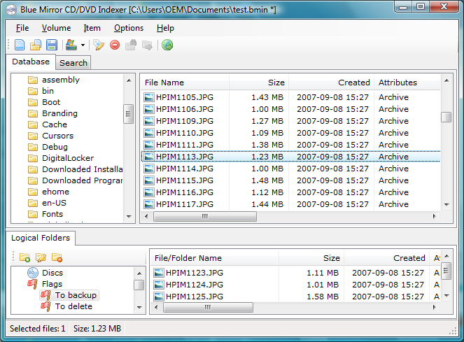
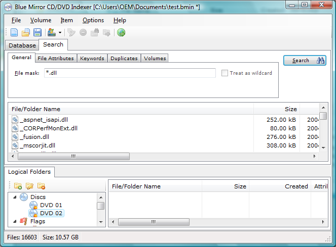
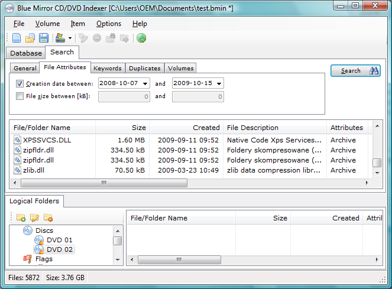

# BlueMirror.Octopus
CD/DVD File Indexer

## Project Description ##

This application (CD/DVD cataloguer) creates indexes (table of contents) of your floppy or CD/DVD discs. It helps you maintain and organize your collection of floppies, CDs and DVDs. It is designed to be simple, small, effective and easy to use. Written in C# with VS 2008.

## News ##

The latest version 2.0.1.0 is available here: http://bluemirrorsoftware.github.io/Octopus/setup/install.htm

## Screenshots ##

Main window:

Search window:

Search window (advanced view):

Read volume dialog:

Reading options:

