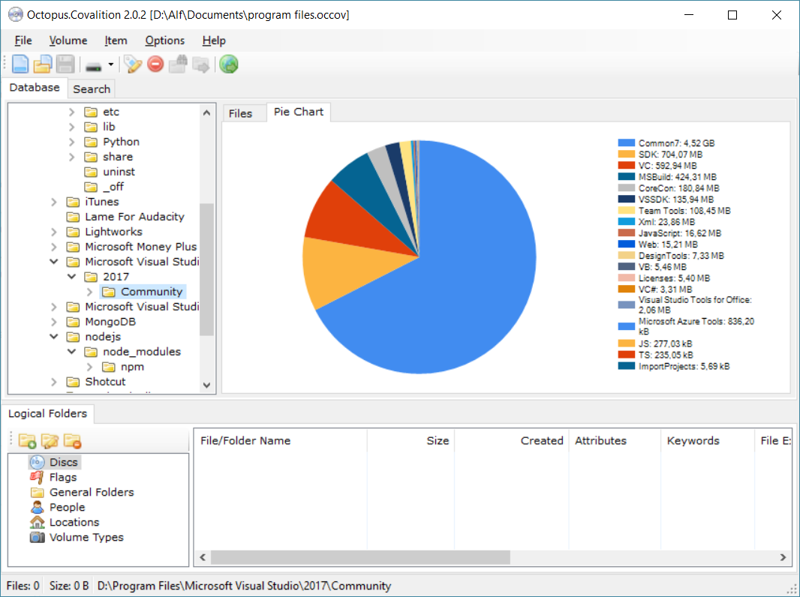

# Octopus.Covalition
Yet Another CD/DVD/HD Indexer

## Project Description ##

This application creates indexes (table of contents) of your floppies, CD/DVD disks, hard/external/network disks, pendrives and other removables media etc. It helps you organize and maintain your collection of files and provides reasonable search capabilities. It is designed to be simple, small, effective and easy to use. Written in C#.

Former name: _Blue Mirror CD/DVD Indexer_.

### System Requirements ###

* For use: .NET Framework 4.5
* For development: Visual Studio 2017

## Installation ##

You can download and install this application from: https://github.com/covalition/octopus/releases

## Screenshots ##

Main window:

Search window:

Search window (advanced view):

The "Reading volume..." dialog box:

Reading options:

Basic statistics:

